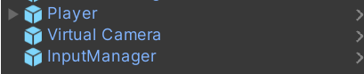
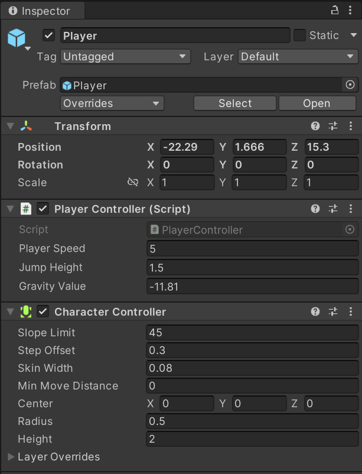
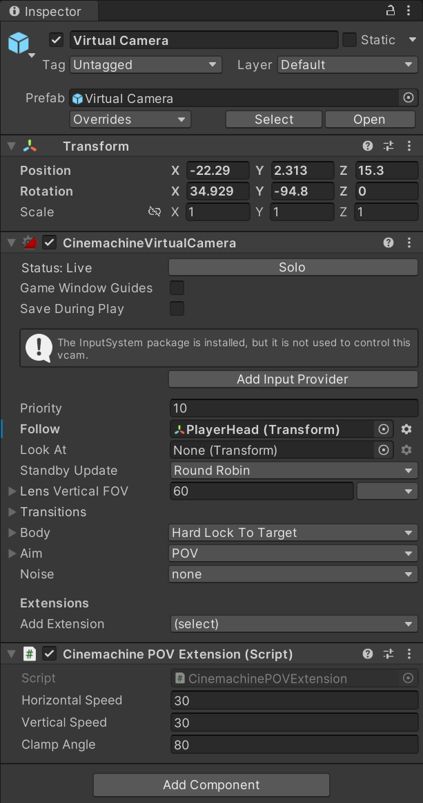

# FPS Character Controller

Based on [Samyam](https://www.youtube.com/@samyam) video [here](https://www.youtube.com/watch?v=5n_hmqHdijM)

Download : [Here](FpsCharacterController.unitypackage) 

Depends on :
- Cinemachine
- Input System

Implements :
- Add Player Prefab
- Add Virtual Camera Prefab
- Add InputManager Prefab
- Add CinemachineBrain to main Camera

